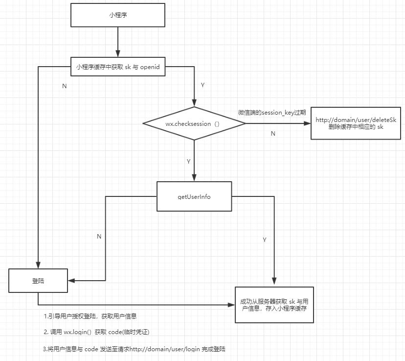

# 接口说明

## 评论模块

### 添加评论
    
    http://domain/comment/add
	
#### 请求方法：post

#### 请求参数：如下 (除了 time 必选，建议传递 time)
	
	{
		"userid": "10008",
		"openid": "ooLul5CHCCZGeIZ9B1-mGuKfdiag",
		"sk": "9fa8a9be19ad96cdc8fd79b4af94053d",
		"echoid": "66709090",
		"content": "KYOKA rushball",
		"time": "2018-12-05 08:20:00" 
	}

#### 返回结果

	success:
	{
	    "status": 200,
	    "message": "Transaction complete"
	}

	fail:
	{
	    "status": 500,
	    "error": "openid is not exits" or "sk is not exits"
	}

### 对评论点赞

	http://domain/comment/like
#### 请求方法：post

#### 请求参数：如下

	{
	"userid": "10008",
	"openid": "ooLul5CHCCZGeIZ9B1-mGuKfdiag",
	"sk": "9fa8a9be19ad96cdc8fd79b4af94053d",
	"commentid": "2",
	"flag": 1,
	"time": "2018-12-05 08:20:00"
	}

#### 返回结果

	success:
	{
	    "status": 200,
	    "message": "Transaction complete"
	}

	fail:
	{
	    "status": 500,
	    "error": "openid is not exits" or "sk is not exits"
	}

#### 说明

	flag：0  => 取消点赞
	flag: 1  => 点赞

### 对评论不满

	http://domain/comment/dislike

#### 请求方法：post

#### 请求参数：如下

	{
		"userid": "10008",
		"openid": "ooLul5CHCCZGeIZ9B1-mGuKfdiag",
		"sk": "9fa8a9be19ad96cdc8fd79b4af94053d",
		"commentid": "3",
		"time": "2018-12-05 08:20:00"
	}

#### 返回结果
	
	success:
	{
	    "status": 200,
	    "message": "Transaction complete"
	}

	fail:
	{
	    "status": 500,
	    "error": "openid is not exits" or "sk is not exits"
	}

### 获取指定 id 回音壁信息的评论

	http://domain/comment/list?echoid=xxxxx&page=xxxx

#### 请求方法：get

#### 返回结果
	
	success:
	[
	    {
	        "comment_id": 2,
	        "comment_username": "Lcanboom",
	        "comment_userAvatarUrl": "https://wx.qlogo.cn/mmopen/vi_32/8m1L3YXwEKW8lyEPLzRDRrEGovOXibvYLnicuzRIQfmP5VqRev2gLfyfqpia29UdauNDiatbHexoVZaPkichJvLJFFw/132",
	        "content": "KYOKA",
	        "likeNum": 2,
	        "dislikeNum": 0,
	        "time": "2018-12-05 08:20:00"
	    },
	    {
	        "comment_id": 3,
	        "comment_username": "Lcanboom",
	        "comment_userAvatarUrl": "https://wx.qlogo.cn/mmopen/vi_32/8m1L3YXwEKW8lyEPLzRDRrEGovOXibvYLnicuzRIQfmP5VqRev2gLfyfqpia29UdauNDiatbHexoVZaPkichJvLJFFw/132",
	        "content": "KYOKA",
	        "likeNum": 0,
	        "dislikeNum": 3,
	        "time": "2018-12-05 08:20:00"
	    },
	    {
	        "comment_id": 4,
	        "comment_username": "Lcanboom",
	        "comment_userAvatarUrl": "https://wx.qlogo.cn/mmopen/vi_32/8m1L3YXwEKW8lyEPLzRDRrEGovOXibvYLnicuzRIQfmP5VqRev2gLfyfqpia29UdauNDiatbHexoVZaPkichJvLJFFw/132",
	        "content": "KYOKA lrushball",
	        "likeNum": 0,
	        "dislikeNum": 0,
	        "time": "2018-12-05 08:20:00"
	    }
	]

	fail:
	[] (空数组)

## 热度模块

### 按照近两周浏览量排行

	http://domain/hot/byview?page=1

#### 请求方法：get

#### 返回结果

	[
	    {
	        "id": "68322486",
	        "title": "保研排名",
	        "box": "教务处信箱",
	        "time": "2018-09-21 08:37:00"
	    },
	    {
	        "id": "68250820",
	        "title": "关于成绩推免保研",
	        "box": "教务处信箱",
	        "time": "2018-09-09 16:42:00"
	    },
	    {
	        "id": "66709090",
	        "title": "新生宿舍床位",
	        "box": "学生处信箱",
	        "time": "2016-08-29 15:08:00"
	    }
	]	

	fail:
	[] (空数组)

## 登陆模块

### 登陆

	http://domain/user/login

#### 请求方法：post

#### 请求数据：如下

	{
		"code":"xxxxxxxxxxxxxxxxx",
		"userInfo":{
						"nickName":"Lcanboom","gender":1,"language":"zh_CN",
						"city":"",
						"province":"",
						"country":"Belgium",
						"avatarUrl":"xxxxxxxxxxxxxxxxxxxxxxxxxxxxxxxx"
					}
	}

#### 返回结果：
	
	success：
	{
	    "sk": "ecdccff06d08963ee93e5ce73741f949",
	    "status": 200,
	    "userInfo": {
				        "nickName": "Lcanboom",
				        "gender": 1,
				        "language": "zh_CN",
				        "city": "",
				        "province": "",
				        "country": "Belgium",
				        "avatarUrl": "https://wx.qlogo.cn/mmopen/vi_32/8m1L3YXwEKW8lyEPLzRDRrEGovOXibvYLnicuzRIQfmP5VqRev2gLfyfqpia29UdauNDiatbHexoVZaPkichJvLJFFw/132",
				        "openid": "ooLul5CHCCZGeIZ9B1-mGuKfdiag"
	    			}
	}

### 获取用户信息

	http://domain/user/getUserInfo
#### 请求方法：post

#### 请求数据：如下	

	{
		"sk": "3c926b232xxxxxxx831eeb0dbcaa6a",
		"openid": "ooLul5CxxxxxxB1-mGuKfdiag"
	}

#### 返回结果
	
	success：
	{
	    "userInfo": [
	        {
	            "id": 10008,
	            "avatarUrl": "https://wx.qlogo.cn/mmopen/vi_32/8xxxxxxxxxxxxxxxxxxxxRDRrEGovOXibvYLnicuzRIQfmP5VqRev2gLfyfqpia29UdauNDiatbHexoVZaPkichJvLJFFw/132",
	            "city": "",
	            "country": "Belgium",
	            "gender": "1",
	            "language": "zh_CN",
	            "nickName": "Lcanboom",
	            "openId": "ooLul5CHxxxxxxxxxxx1-mGuKfdiag",
	            "province": ""
	        }
	    ],
	    "status": 200
	}

	fail:
	{
	    "status": 500,
	    "error": "openid is not exits" or "sk is not exits"
	}

### 清除过期的 sk

	http://domain/user/deleteSk
#### 请求方法：post

#### 请求数据：如下

	{
		"sk": "3c926b232599617b87831eeb0dbcaa6a"
	}

#### 返回结果：
	
	success:
	{
	    "isDeleted": 1,
	    "message": "过期的 sk 已删除"
	}

	fail:
	{
	    "isDeleted": 0,
	    "message": "sk 不存在"
	}

### 登陆流程

#### 登陆态说明:

由于微信不会把 session_key 的有效期告知开发者。我们会根据用户使用小程序的行为对 session_key 的使用频度设计
过期时间，但是可以通过 wx.checkSession() 检验是否过期。

因此可以使用 wx.checkSession() 的结果判定缓存在小程序端的 sk (用户的登陆状态标识符) 是否过期，没过期则可以
直接获取用户信息，否则，重新登陆获取新的 sk 以及用户信息。

目前打算使用这种方案。

> 当然也可以在服务端重新自定义 sk 的过期时间

#### 参考

- [开放能力 · 小程序](https://developers.weixin.qq.com/miniprogram/dev/framework/open-ability/login.html)

- [微信小程序中用户登录和登录态维护](https://www.jianshu.com/p/c5f6c98b2685)

- [微信小程序登录会话流程学习](https://segmentfault.com/a/1190000014894747#articleHeader0)

